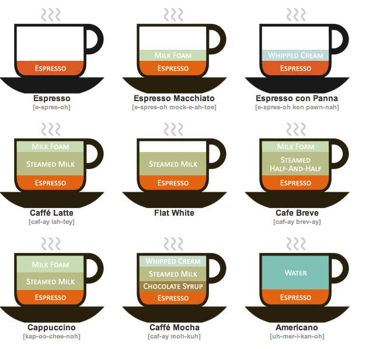

# Data Points: Visualization That Means Something

# Chapter 1 - Understanding Data

- Visualization is a representation of data that helps you see what you otherwise would have been blind to if you looked only at the raw source.
- Data represents real life.
- You have to know the who, what, when, where, why, and how - the metadata, or the data about the data- before you can know what the numbers are actually about.
    - **Who:** Data from a reputable source typically implies better accuracy than a random online poll.
    - **How:** People often skip methodology because it tends to be complex and for a technical audience, but it’s worth getting to know the gist of how the data of interest collected.
    - **What:**  You want to know what your data is about, but before you can do that, you should know what surrounds the numbers.
    - **When:** This seems obvious, but it’s a common mistake to take old data and pass it off as new because it’s what’s available. Things change, people change, and places change, and so naturally, data changes.
    - **Where:** Things can change across cities, states, and countries just as they do over time.
    - **Why:** You must know the reason data was collected, mostly as a sanity check for bias.
- To visualize data, you must understand what it is, what it represents in the real world, and in what context you should interpret it in.

# Chapter 2 - Visualization: The Medium

- The purpose of visualization is to convey a certain piece of information. This information could pertain to any subject matter or topic, but the essential requirement is that it should effectively communicate a specific detail or set of details about that particular something. In the end, the key intent behind creating a visualization is to inform or educate the viewer about a certain aspect in a clear and understandable manner.

# Chapter 3 - Representing Data

- When you visualize data, you represent it with a combination of visual cues that are scaled, coloured, and positioned according to values.
- Working parts, several pieces work together to make a graph:
    - Title of graph: A description of the data or something worth highlighting to set the stage.
    - Visual Cues: Visualization involves encoding data with shapes, colours, and sizes. Which cues you choose depends on your data and your goals.
    - Coordinate System: You map data differently with a scatterplot than you do with a pie chart. It’s x- and y- coordinates in one and angles with the other; it’s cartesian versus polar.
    - Scale: Increments that make sense can increase readability, as well as shift focus.
    - Context: If you audience is unfamiliar with the data, it’s your job to clarify what values represent and explain how people should read your visualization.
- Visual cues:
    - Length:
        
        
        Incorrect chart:
        
        
        
        Correct chart:
        
        
        
        We can see that the y-axis starts at 32% in one graph and at 0% in another. This changes the way you perceive the information. In the first graph, the gap appears larger than in the second one, even though the gap is the same.
        
    - Colour:
        - When you use a palette, you must think if someone has a red-deficiency or is green-deficient.
            
            
            
        - One thing you can use is a monochrome color, but use the saturation to express different ideas.
    - Scales:
        - In a linear scale, the focus is on values that are evenly spaced. Each unit of measurement on the scale is equal in size to every other unit. For instance, the difference between 1 and 2 is the same as the difference between 9 and 10.
        - On the other hand, a logarithmic scale focuses on percentage change rather than absolute differences. This means that each unit of measurement on this scale represents a tenfold increase over the previous one. So, the difference between 1 and 2 on a logarithmic scale is the same as the difference between 10 and 100.
    - Chart Suggestions:
        
        
        
        # Chapter 4 - Exploring Data Visually
        
        - You should consider these four things when you explore your data visually:
            - What data do you have?
            - What do you want to know about your data?
            - What visualization methods should you use?
            - What do you see and does it makes sense?
        - Visualizing categorical data:
            - Categories:
                - Best charts: Bar graph and symbol plot.
            - Parts of a whole:
                - Best charts: Stacked bar graph and pie.
            - Subcategories:
                - Best charts: Tree-map, Mosaic plot.
        - Visualizing time series data:
            - Time series:
                - Bar graph: Useful for discrete points in time.
                - Line chart: Lines can make it easier to see trends.
                - Dot plot: Shows distinct points but might need line to show trend if not much data.
                - Dot-bar graph: Focuses more on endpoints than a bar graph.
            - Cycles:
                - Radial plot: Similar to line chart but wraps around.
                - Calendar: Patterns for days of week seen more easily than views above.
        - Visualizing Spatial data:
            - Locations:
                - Location map: Points represent locations and can be scaled by metric.
                - Connections: Points can be connected to show relationships between locations.
            - Regions:
                - Choropleth map: Defined regions coloured by data and meaning can change based an scale.
                - Contour map: Lines show data continuously over geography, using density.
        - Multiple variables:
            -